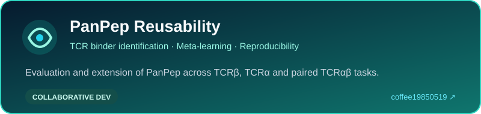
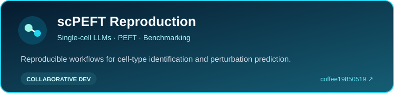
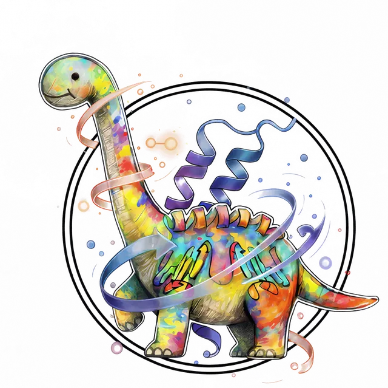
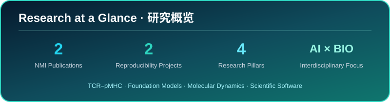
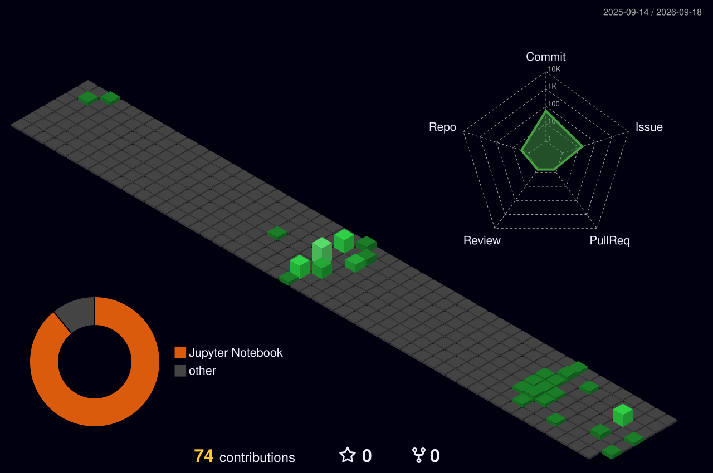

### 王先煜 · Xianyu Wang

**Ph.D. Student · AI for Science Center & School of Life Sciences**  
**Northeast Normal University · 东北师范大学**

## About Me · 关于我

I am a Ph.D. student at the **AI for Science Center** and the **School of Life Sciences, Northeast Normal University**. My research lies at the intersection of artificial intelligence, bioinformatics, and life science, with a particular focus on computational immunology and biological foundation models.

我是东北师范大学 **AI for Science Center** 与 **生命科学学院** 的博士研究生。研究聚焦人工智能、生物信息学与生命科学的交叉领域，重点关注计算免疫学、生物大模型及可复现的生命科学工具开发。

- 🧬 **Computational immunology · 计算免疫学** — TCR–pMHC binding, interaction, and antigen-specific TCR recognition
- 🤖 **Biological foundation models · 生物大模型** — protein language models, single-cell LLMs, and parameter-efficient fine-tuning
- ⚛️ **Structural & dynamic bioinformatics · 结构与动态生物信息学** — molecular dynamics simulation and conformational analysis
- 🛠️ **Scientific software · 科研软件** — reproducible pipelines and practical tools for life-science research

## Research Focus · 研究方向

## Tools & Technologies · 技术栈

`Python` · `PyTorch` · `Jupyter` · `R` · `Linux` · `Git` · `Docker` · `Conda` · `Hugging Face` · `GROMACS` · `OpenMM` · `Amber` · `Slurm / HPC`

## Projects I Contribute To · 参与项目

### PanPep Reusability

**A comprehensive reproducibility, reusability, and extensibility study of PanPep for antigen-specific T-cell receptor binder identification.** The project evaluates inference- and training-level reproducibility and extends the framework to peptide–TCRα and peptide–TCRαβ recognition.

**面向抗原特异性 T 细胞受体结合预测的 PanPep 可复现性、可复用性与可扩展性研究。** 项目系统评估推理和训练层面的复现能力，并扩展至 peptide–TCRα 与 peptide–TCRαβ 识别任务。

**Role · 身份：** Collaborative developer · 共同开发

**Repository owner · 仓库账号：** [`coffee19850519`](https://github.com/coffee19850519)

---

### scPEFT Reproduction

**Reproduction and benchmarking workflows for parameter-efficient fine-tuning of single-cell large language models.** The project supports multiple scLLM backbones and downstream tasks, including cell-type identification and perturbation prediction.

**面向单细胞大语言模型参数高效微调的复现与基准评估流程。** 项目覆盖多种 scLLM 骨干模型及细胞类型识别、扰动预测等下游任务。

**Role · 身份：** Collaborative developer · 共同开发

**Repository owner · 仓库账号：** [`coffee19850519`](https://github.com/coffee19850519)

## Selected Publications · 代表论文

1. **He, F., Wang, X. & Xu, D.**  
   [*Reusability report: Meta-learning for antigen-specific T cell receptor binder identification*](https://doi.org/10.1038/s42256-026-01236-6).  
   **Nature Machine Intelligence** 8, 818–829 (2026).

2. **He, F., Fei, R., Krull, J. E., Yu, Y., Zhang, X., Wang, X., et al.**  
   [*Harnessing the power of single-cell large language models with parameter-efficient fine-tuning using scPEFT*](https://doi.org/10.1038/s42256-025-01170-z).  
   **Nature Machine Intelligence** 8, 118–133 (2026).  
   *Contribution: performed experiments and contributed analytical tools.*

## Research Group · 研究团队

I conduct research with the **Ren Protein Design Group (RPD Group)**, focusing on protein design and related computational research at the intersection of artificial intelligence and life science.

我在 **Ren Protein Design Group（RPD Group）** 开展研究，团队聚焦蛋白质设计，以及人工智能与生命科学交叉领域的相关计算研究。

 

## Research Snapshot · 研究概览

## 3D Contributions · 3D 贡献图

## Contribution Journey · 贡献轨迹

<picture>
  <source media="(prefers-color-scheme: dark)" srcset="./dist/github-snake-dark.svg" />
  <source media="(prefers-color-scheme: light)" srcset="./dist/github-snake.svg" />
  
</picture>

## Contact · 联系方式

